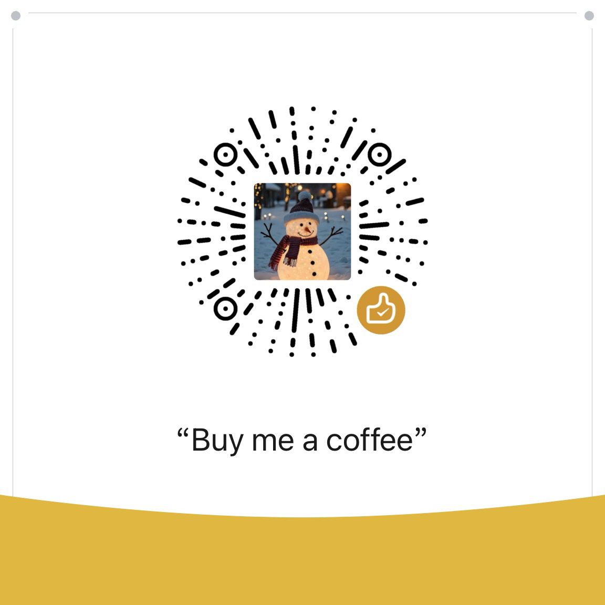

# 爸爸不能时刻在身边：写给未来你的安全架构

《爸爸不能时刻在身边》是一位考取了 CISSP（注册信息系统安全专家）认证的父亲，写给女儿（以及所有未成年孩子和家长）的一本**生活安全实操手册**。

本书的初衷并非制造焦虑或恐吓，而是希望将信息安全领域中严密的防御逻辑（如：纵深防御、零信任、访问控制、权限管理等），降维、生动地应用到日常生活之中。通过极其具象、可落地的操作细节，为孩子建立起一套在脑海中随时运转的“安全防护系统”。

**真正的安全不在于危险发生时的殊死搏斗，而在于防患于未然。**

## 📖 核心内容框架

目前这本小册子的全书六大章节与结语**已全部更新完毕**，内容包括：

- **前言：致我三岁的女儿** —— 当我不能时刻在你身边，我想送你一套人生的防火墙。
- **第一章：建立你的安全基础** —— 认识生活中的 CIA 三要素，理解“零信任”原则（绝不轻易相信，永远保持验证），学会面对危险时的极智“止损”与资产分类。
- **第二章：保护好你的大门钥匙** —— 建立社交边界，利用“多因素认证”巧妙识人，警惕人际交往中“得寸进尺”的越界行为。
- **第三章：给你的小世界建一座堡垒** —— 物理环境的安全加固。涵盖独自防尾随、巧用电梯盲区、打车安全站位、酒店水杯报警阵等极具实操价值的“物理外挂”。
- **第四章：当一个会“隐身”的数字忍者** —— 保护数字隐私。从防范免费 WiFi 陷阱，到清理照片隐形便签，再到用花露水一秒销毁快递单隐私的数字隐身术。
- **第五章：识破人心的漏洞** —— 社会工程学防御。破解坏人制造的“权威压迫”与“绝境紧迫感”，教孩子巧用“系统挂起法”与家庭独家紧急暗号。
- **第六章：危机时刻的生存法则** —— 应急响应与灾难恢复。当所有防线被攻破时，如何打破旁观者效应、利用财产连带损坏脱身，以及保全关键 DNA 证据进行绝地求生。
- **结语：愿你拥有屠龙技** —— 最大的安全是免于恐惧地去爱。愿你一生这把刀只用于切开香甜的蛋糕。

## 💡 谁适合阅读这本书？

- **希望培养孩子自我保护意识的父母**：您可以将其作为睡前故事的素材，或是家庭防范演习的参考讲义，温柔且坚定地赋予孩子保护自己的力量。
- **正在慢慢长大的青少年/未成年人**：书中没有枯燥的 IT 术语，每一招都是可以直接抄作业、拿来就用的“避险小套路”。
- **每一位需要提高日常安全敏锐度的人**：无论年龄大小，书中关于独居、出行、数字隐私保护的实操理念同样非常适用。

## ☕ 赞助一杯咖啡

这本手册的全部文稿目前已经在此完全开源并更新完毕。**如果在阅读过程中，您对孩子安全教育有任何意见、补充或者建议，欢迎随时通过留言区或 Issues 与我交流！** 

如果您觉得书中的理念或者某个实用的小妙招对您、对您的孩子或身边的朋友有所启发和帮助，欢迎扫码请这位熬夜码字的全职小册子老爸喝一杯咖啡！您的肯定与交流，是我持续完善这一切的最大动力。

---
*愿每一个孩子都能掌握保护自己的“屠龙技”，更愿这世界能护他们永远只需用它来切水果。*